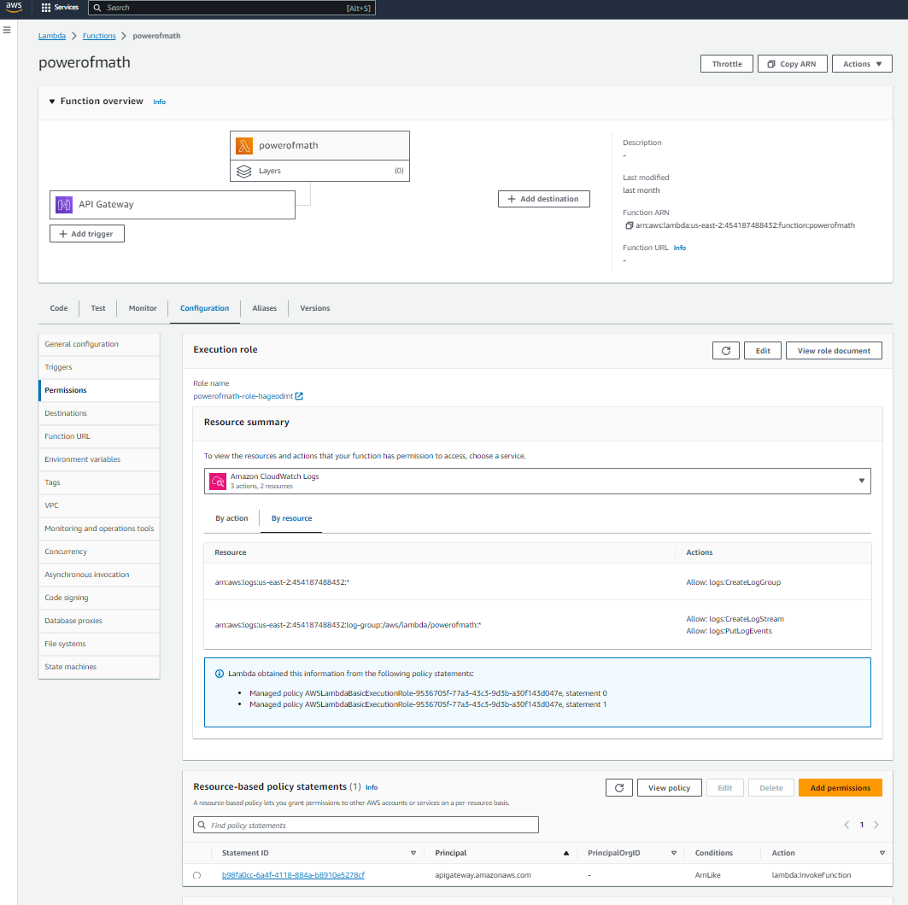

# Project
AWS Project - Architect and Build an End-to-End AWS Web Application

Services used and demonstrated :

![Alt text][def]

[def]: image.png

Create an index.html page from scratch in a text editor code the website and zip the file :    

Deploying and hosting a web page with AWS Amplify:

Creating a Python code in Lambda function to implement our math functionality :

Creating a REST API for our Lambda function using API Gateway:

Creating a new DynamoDB table to store our math result:

Giving Lambda permission to write to the DynamoDB table:

Updating the Lambda function code to write to the DynamoDB table:

Updating the index.html page to call API Gateway:

Re-deploying our index.html page using Amplify:
